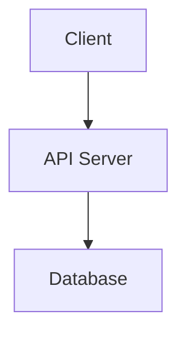
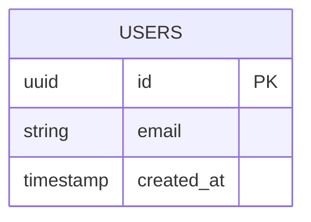
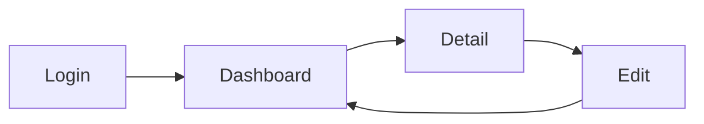

## 対応する要求定義

<!-- 関連する要求定義Issueへのリンク -->
Closes #

## アーキテクチャ設計（CTOが記入）

### システム構成

<!-- コンポーネント構成を記載。Mermaid記法推奨 -->



### 技術スタック

| レイヤー | 技術 | 選定理由 |
|---------|------|---------|
| フロントエンド | | |
| バックエンド | | |
| データベース | | |
| インフラ | | |
| CI/CD | GitHub Actions | 標準 |

### データモデル

<!-- ER図をMermaid記法で記載 -->



### API設計方針

| 項目 | 方針 |
|------|------|
| プロトコル | REST / GraphQL / gRPC |
| 認証方式 | |
| エラーレスポンス形式 | |
| ページネーション | |

### 非機能要件

| 項目 | 目標 |
|------|------|
| レスポンスタイム | ms以内 |
| 同時接続数 | |
| 可用性 | % |
| データ保持期間 | |

## UXフロー設計（Designerが記入）

### AsIs / ToBe 業務フロー

**AsIs（現状）:**
<!-- 現状の業務フローを記載 -->

**ToBe（あるべき姿）:**
<!-- 改善後の業務フローを記載 -->

### 画面遷移図

<!-- Mermaid記法 or テキストで記載 -->



### 画面一覧

| # | 画面名 | 概要 | 対応ユーザーストーリー |
|---|--------|------|----------------------|
| 1 | | | #REQ-x |
| 2 | | | #REQ-x |

### ワイヤーフレーム

<!-- 各画面の構成要素をテキストで記載。Figmaリンクがあれば添付 -->

**画面1: ○○**
```
┌─────────────────────┐
│ Header / Nav        │
├─────────────────────┤
│                     │
│   Main Content      │
│                     │
├─────────────────────┤
│ Footer              │
└─────────────────────┘
```

---

### Gate 2 チェックリスト

- [ ] アーキテクチャが要件を満たしている（CTO承認）
- [ ] データモデルが正規化されている（CTO承認）
- [ ] 技術スタックの選定理由が明記されている
- [ ] UXフローがユーザーストーリーをカバーしている（Designer + PDM承認）
- [ ] 非機能要件が定義されている
- [ ] AsIs / ToBe の差分が明確

> 全チェック通過後 → `gate-2-approved` ラベルを付与
